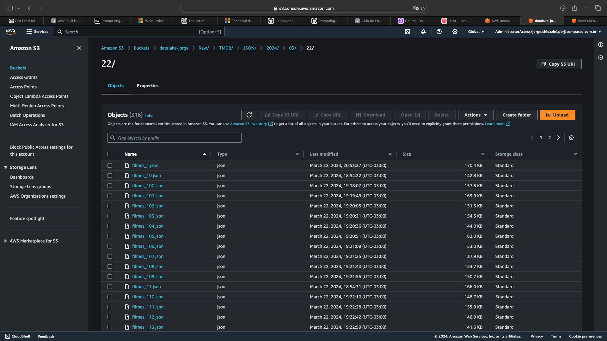
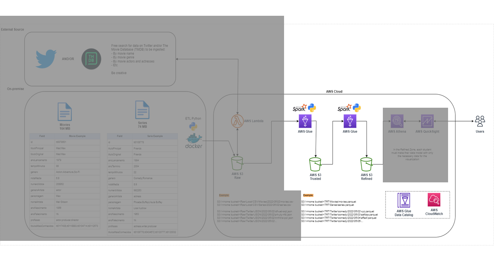
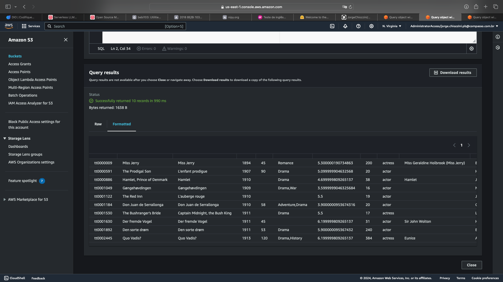
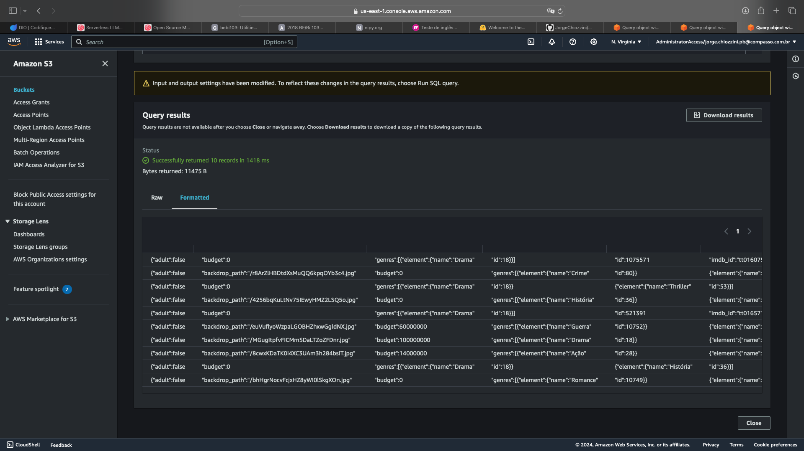
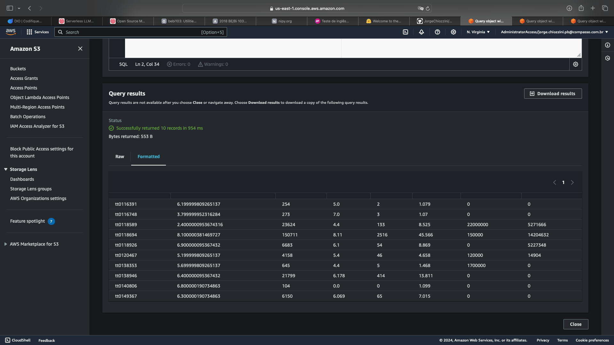
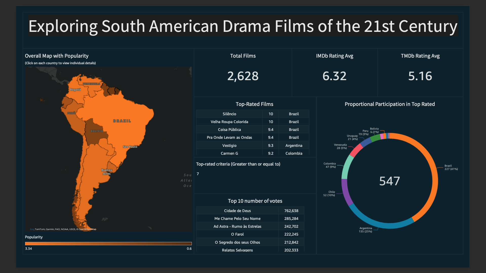
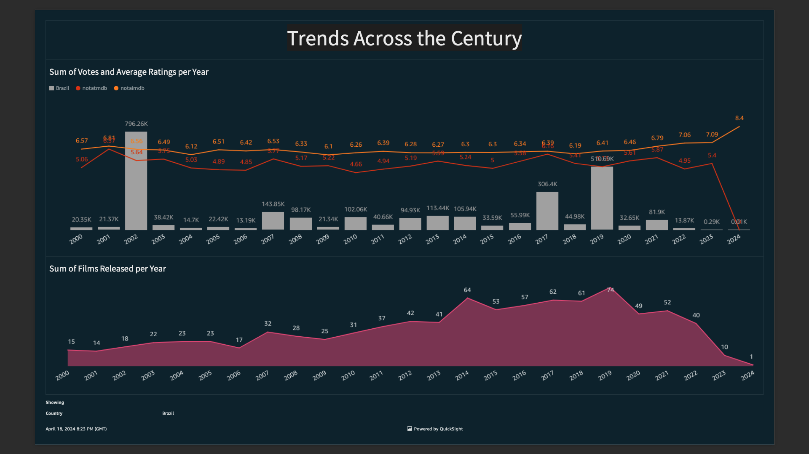
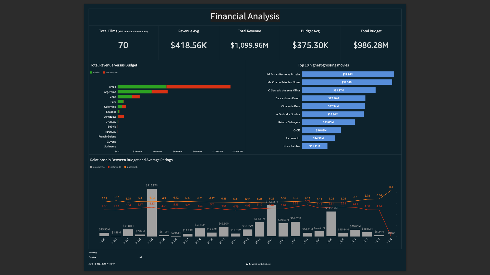

<h1 align="center"> Desafio</h1>

<p align="center">
 <a href="#Desafio1">Etapa I</a> •
 <a href="#Desafio2">Etapa II</a> •
 <a href="#Desafio3">Etapa III</a> •
 <a href="#Desafio4">Etapa IV</a>
</p>

O desafio consistiu na construção de um pipeline de dados completo para análise de filmes e séries, abrangendo desde a ingestão de dados brutos até a visualização de insights. Utilizando serviços da AWS como S3, Lambda e Glue, o processo envolveu a ingestão de dados de diferentes fontes, como arquivos CSV e API do TMDB, integração e processamento dos dados, modelagem dimensional e criação de um dashboard interativo no QuickSight para apresentar os resultados. O objetivo final foi extrair insights sobre produções cinematográficas sul-americanas do gênero drama no século XXI e fornecer uma visão abrangente para tomada de decisões.

---
<br>

<a id="Desafio1"></a>

### Desafio Parte I - ETL

 

---

**Instruções da Tarefa**

**Ingestão Batch:**

A ingestão dos arquivos CSV será realizada no Bucket Amazon S3 RAW Zone. Nesta etapa do desafio, é necessário construir um código Python que será executado dentro de um container Docker para carregar os dados locais dos arquivos para a nuvem. O processo utilizará principalmente a biblioteca boto3 para a ingestão via batch, gerando arquivos CSV.

1. **Implementar código Python:**
    - Ler os 2 arquivos (filmes e séries) no formato CSV inteiros, ou seja, sem filtrar os dados.
    - Utilizar a biblioteca boto3 para carregar os dados para a AWS.
    - Acessar a AWS e gravar no S3, no bucket definido como RAW Zone.
    - No momento da gravação dos dados, considerar o padrão:
        ```
        S3://data-lake-do-fulano/Raw/Local/CSV/Movies/2022/05/02/movies.csv
        S3://data-lake-do-fulano/Raw/Local/CSV/Series/2022/05/02/series.csv
        ```
        Onde:
        - `data-lake-do-fulano` é o nome do bucket.
        - `Raw` é a camada de armazenamento.
        - `Local` é a origem do dado.
        - `CSV` é o formato do dado.
        - `Movies` ou `Series` são as especificações do dado.
        - `2022/05/02` é a data de processamento separada por ano/mês/dia.
        - `movies.csv` ou `series.csv` é o nome do arquivo.

<br>

- [Resultado - s3_uploader.py](etapa-1/s3_uploader.py)

<br>

2. **Criar container Docker com um volume para armazenar os arquivos CSV e executar processo Python implementado.**

- [Resultado - dockerfile](etapa-1/dockerfile)

```
$ docker build -t meu_container .      
```
 

<br>

3. **Executar localmente o container Docker para realizar a carga dos dados ao S3.**

- [dados](etapa-1/dados/dados.zip)
- [.env](etapa-1/.env)

```
$ docker run -it -v /Users/jorgechiozzini/Desktop/Workspace/Data-Analytics-Compass/Desafio/etapa-1/dados:/root/app/dados --env-file .env meu_container 
```


Diretório Movies no Bucket S3:


Diretório Series no Bucket S3:


---
<br>

<a id="Desafio2"></a>

### Desafio Parte II - Ingestão de dados do TMBD

 

---
**Etapa 2 - Ingestão streaming/micro batch**

Nesta etapa do desafio capturaremos dados do TMDB, utilizando AWS Lambda para realizar chamadas de API. Os dados coletados devem ser persistidos no Amazon S3, na camada RAW, mantendo o formato da origem (JSON).  
O objetivo desta etapa é complementar os dados dos Filmes e Series, carregados na Etapa 1, com dados oriundos do TMDB. Opcionalmente, você pode complementar com mais dados de outra API de sua escolha.

- [**Relatório sobre minha proposta**](etapa-2/evidencias/minhaProposta.md) 

**Perguntas dessa tarefa**

Em sua conta AWS, no serviço AWS Lambda, realize as seguintes atividades:
1.  Criar nova camada (layer) no AWS Lambda para as libs necessárias à ingestão de dados.

    Layer:

    

    api_key do TMDB em Environment variables e localmente no apikey.py: 

    

    - [apikey.py](etapa-2/evidencias/apikey.py)   
    
    <br>

2. Implementar o código Python em AWS Lambda para consumo de dados do TMDB:
   - Buscar, pela API, os dados que complementem a análise
   - Utilizar a lib boto3 para gravar os dados no AWS S3, em arquivos JSON.
    -----| no momento da gravação dos dados deve-se considerar o padrão de path: <nome do bucket>\<camada de armazenamento>\<origem do dado>\<formato do dado>\<especificação do dado>\<data de processamento separada por ano\mes\dia>\<arquivo>
              São exemplos de caminhos de arquivos válidos:
               - S3:\\data-lake-do-fulano\raw\tmdb\json\2023\10\31\prt-uty-nfd.json
               - S3:\\data-lake-do-fulano\raw\tmdb\json\2023\10\31\idf-uet-wqt.json


    - [Código usado na Lambda - lambda_handler.py](etapa-2/evidencias/lambda_handler.py) 

    <br>

    CloudWatch Log events:

    

    - [output lambda](etapa-2/evidencias/output_lambda/) 
    
    <br>

    Path:

    
    
    <br>

    Informação adicional:
    Podemos utilizar os serviços  CloudWatch Event ou Amazon EventBridge para agendar extrações periódicas de dados no TMDB de forma automática.

    Schedule detail (Dia 01 todos os meses):

    

    Target:

    

---
<br>

<a id="Desafio3"></a>

### Desafio Parte III - Camadas Trusted e Refined



---
**Tarefa 3 - Processamento da Trusted**

A camada Trusted de um data lake corresponde àquela em que os dados encontram-se limpos e são confiáveis. É resultado da integração das diversas fontes de origem, que encontram-se na camada anterior, que chamamos de Raw.

Aqui faremos uso do Apache Spark no processo, integrando dados existentes na camada Raw Zone. O objetivo é gerar uma visão padronizada dos dados, persistida no S3,  compreendendo a Trusted Zone do data lake.  Nossos jobs Spark serão criados por meio do AWS Glue.

Todos os dados serão persistidos na Trusted no formato PARQUET, particionados por data de coleta do TMDB (dt=<ano-mês-dia> exemplo: dt=2023-11-31). A exceção fica para os dados oriundos do processamento batch (CSV), que não precisam ser particionados.

Iremos separar o processamento em dois jobs: o primeiro, para carga histórica, será responsável pelo processamento dos arquivos CSV  e o segundo, para carga de dados do TMDB (e outra API, se utilizada). Lembre-se que suas origens serão os dados existentes na RAW Zone.

- [Resultado - Script Glue para Trusted CSV](etapa-3/evidencias/trusted_movies.py) 

- [Resultado - Script Glue para Trusted JSON](etapa-3/evidencias/trusted_tmdb.py)

Camada Trusted no Bucket S3:


Query s3 do parquet movies CSV:



Query s3 do parquet tmdb JSON:



<br>

**Tarefa 4 - Modelagem de dados da Refined**

A camada Refined corresponde à camada de um data lake em que os dados estão prontos para análise e extração de insights. Sua origem corresponde aos dados da camada anterior, a Trusted.

Devemos pensar em estruturar os dados seguindo os princípios de modelagem multidimensional, a fim de permitir consultas sobre diferentes perspectivas.

Nesta etapa do desafio, você deve fazer a modelagem de dados da camada refined, definindo as tabelas e, se necessário, views, a fim de disponibilizar os dados para a ferramenta de visualização (QuickSight, a partir da próxima Sprint). Lembre-se que a origem será os dados oriundos da Trusted Zone.

Modelagem relacional de chave única:


<br>

**Tarefa 5 - Processamento da Refined**

Na atividade anterior, você definiu seu modelo de dados da camada Refined. Agora você deve processar os dados da camada Trusted, armazenando-os na Refined, de acordo com seu modelo.

Usaremos novamente do Apache Spark no processo, utilizando jobs cuja origem sejam dados da camada Trusted Zone e o destino, a camada Refined Zone. Aqui, novamente, todos os dados serão persistidos no formato PARQUET, particionados, se necessário,  de acordo com as necessidades definidas para a camada de visualização. Além disso, é necessário registrar as tabelas geradas no AWS Glue Data Catalog para poder fazer consultas posteriormente.

- [Resultado - Script Glue para Refined](etapa-3/evidencias/refined.py)

Camada Refined no Bucket S3:


Query s3 do parquet Filme_Fato:



Tabelas no Data Catalog:


---
<br>

<a id="Desafio4"></a>

### Desafio Parte IV - Consumo e Apresentação dos Dados


Chegamos na última etapa do desafio. Até este ponto, suas atividades no data lake foram voltadas à ingestão e preparação dos dados. Agora é momento de extrair insights, apresentando-os através de uma ferramenta de visualização de dados (QuickSight).  
Para tal, você deverá criar um dashboard no AWS QuickSight, utilizando como fonte de dados as tabelas que estão na camada Refined do data lake. Considere utilizar o Athena para como tipo de datasource.  
Lembre-se que um dashboard é um agregado de diferentes visualizações que retratam uma visão agregada e de alto nível sobre os dados. Explore os diferentes recursos que o QuickSight oferece para, a partir dela, realizar uma boa narrativa com os dados disponíveis.

**Perguntas dessa tarefa**  
Desenvolva um dashboard utilizando AWS QuickSight conforme instruções da tarefa.

- [Resultado - Exploring.pdf](etapa-4/Pop.pdf)

Este é o painel central do meu dashboard, onde proponho uma análise prática e dinâmica dos índices de popularidade, considerando algumas informações importantes para o contexto, como os melhores filmes com ajuste de critério dinâmico e os filmes com mais votos, além da proporção de cada país em relação à participação na lista de melhores filmes.



- [Resultado - Trends.pdf](etapa-4/Trend.pdf)

Em seguida, apresento uma análise de série temporal considerando o século 21, que pode ser filtrada tanto por país quanto por data relativa através do menu de controles. Esta análise apresenta as tendências de quantidade de votos, notas médias e filmes lançados.



- [Resultado - Financial.pdf](etapa-4/Money.pdf)

Por fim, complementamos a exploração com a análise financeira, exibindo importantes informações através dos KPIs, a relação entre orçamento e receita, um top 10 de maiores lucros e a análise da relação entre o volume de investimento e a nota média.




---