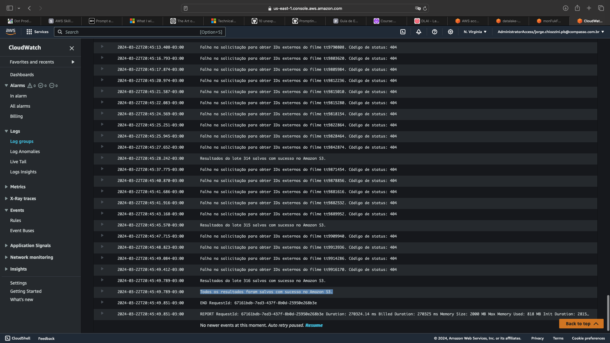

<h1 align="center"> Desafio</h1>

<p align="center">
 <a href="#Desafio1">Etapa I</a> •
 <a href="#Desafio2">Etapa II</a> •
 <a href="#Desafio3">Etapa III</a> •
 <a href="#Desafio4">Etapa IV</a>
</p>

---
<br>

<a id="Desafio1"></a>

### Desafio Parte I - ETL

---

**Instruções da Tarefa**

**Ingestão Batch:**

A ingestão dos arquivos CSV será realizada no Bucket Amazon S3 RAW Zone. Nesta etapa do desafio, é necessário construir um código Python que será executado dentro de um container Docker para carregar os dados locais dos arquivos para a nuvem. O processo utilizará principalmente a biblioteca boto3 para a ingestão via batch, gerando arquivos CSV.

1. **Implementar código Python:**
    - Ler os 2 arquivos (filmes e séries) no formato CSV inteiros, ou seja, sem filtrar os dados.
    - Utilizar a biblioteca boto3 para carregar os dados para a AWS.
    - Acessar a AWS e gravar no S3, no bucket definido como RAW Zone.
    - No momento da gravação dos dados, considerar o padrão:
        ```
        S3://data-lake-do-fulano/Raw/Local/CSV/Movies/2022/05/02/movies.csv
        S3://data-lake-do-fulano/Raw/Local/CSV/Series/2022/05/02/series.csv
        ```
        Onde:
        - `data-lake-do-fulano` é o nome do bucket.
        - `Raw` é a camada de armazenamento.
        - `Local` é a origem do dado.
        - `CSV` é o formato do dado.
        - `Movies` ou `Series` são as especificações do dado.
        - `2022/05/02` é a data de processamento separada por ano/mês/dia.
        - `movies.csv` ou `series.csv` é o nome do arquivo.

<br>

- [Resultado - s3_uploader.py](etapa-1/s3_uploader.py)

<br>

2. **Criar container Docker com um volume para armazenar os arquivos CSV e executar processo Python implementado.**

- [Resultado - dockerfile](etapa-1/dockerfile)

```
$ docker build -t meu_container .      
```
 

<br>

3. **Executar localmente o container Docker para realizar a carga dos dados ao S3.**

- [dados](etapa-1/dados/dados.zip)
- [.env](etapa-1/.env)

```
$ docker run -it -v /Users/jorgechiozzini/Desktop/Workspace/Data-Analytics-Compass/Desafio/etapa-1/dados:/root/app/dados --env-file .env meu_container 
```


---
<br>

<a id="Desafio2"></a>

### Desafio Parte II - Ingestão de dados do TMBD
---
**Etapa 2 - Ingestão streaming/micro batch**

Nesta etapa do desafio capturaremos dados do TMDB, utilizando AWS Lambda para realizar chamadas de API. Os dados coletados devem ser persistidos no Amazon S3, na camada RAW, mantendo o formato da origem (JSON).  
O objetivo desta etapa é complementar os dados dos Filmes e Series, carregados na Etapa 1, com dados oriundos do TMDB. Opcionalmente, você pode complementar com mais dados de outra API de sua escolha.

- [**Relatório sobre minha proposta**](etapa-2/evidencias/minhaProposta.md) 

**Perguntas dessa tarefa**

Em sua conta AWS, no serviço AWS Lambda, realize as seguintes atividades:
1.  Criar nova camada (layer) no AWS Lambda para as libs necessárias à ingestão de dados.

    Layer:

    

    api_key do TMDB em Environment variables e localmente no apikey.py: 

    

    - [apikey.py](etapa-2/evidencias/apikey.py)   
    
    <br>

2. Implementar o código Python em AWS Lambda para consumo de dados do TMDB:
   - Buscar, pela API, os dados que complementem a análise
   - Utilizar a lib boto3 para gravar os dados no AWS S3, em arquivos JSON.
    -----| no momento da gravação dos dados deve-se considerar o padrão de path: <nome do bucket>\<camada de armazenamento>\<origem do dado>\<formato do dado>\<especificação do dado>\<data de processamento separada por ano\mes\dia>\<arquivo>
              São exemplos de caminhos de arquivos válidos:
               - S3:\\data-lake-do-fulano\raw\tmdb\json\2023\10\31\prt-uty-nfd.json
               - S3:\\data-lake-do-fulano\raw\tmdb\json\2023\10\31\idf-uet-wqt.json


    - [Código usado na Lambda - lambda_handler.py](etapa-2/evidencias/lambda_handler.py) 

    <br>

    CloudWatch Log events:

    

    - [output lambda](etapa-2/evidencias/output_lambda/) 
    
    <br>

    Path:

    
    
    <br>

    Informação adicional:
    Podemos utilizar os serviços  CloudWatch Event ou Amazon EventBridge para agendar extrações periódicas de dados no TMDB de forma automática.

    Schedule detail (Dia 01 todos os meses):

    

    Target:

    

---
<br>

<a id="Desafio3"></a>

### Desafio Parte III 
---
**Tarefa 3 - Processamento da Trusted**


**Tarefa 4 - Modelagem de dados da Refined**


**Tarefa 5 - Processamento da Refined**

---
<br>

<a id="Desafio4"></a>

### Tarefa: Desafio Parte IV - 

---