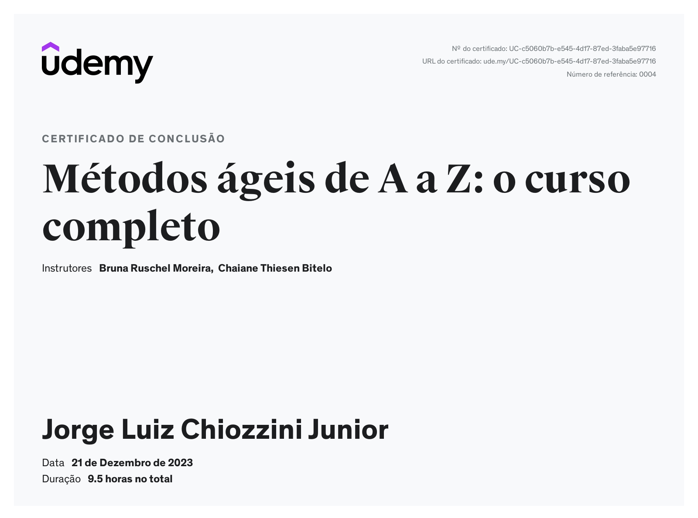

<h1 align="center"> Sprint 0</h1>

 <a href="#sobre">Sobre</a> •
 <a href="#Relatório">Relatório</a> •
 <a href="#Certificados">Certificados</a>

  

## 📎  Sobre

### Cursos

- [Segurança em Aplicações WEB](https://compassuol.udemy.com/course/seguranca-em-aplicacoes-web/learn/lecture/19444718?learning_path_id=3862282#overview)
- [Métodos ágeis de A a Z: o curso completo](https://compassuol.udemy.com/course/metodos-ageis/learn/lecture/25087546?learning_path_id=3862282#overview)

 

## 📝  Relatório de conhecimento

### Cultura Ágil e Segurança WEB
Os Métodos Ágeis, especialmente o SCRUM, oferecem uma abordagem flexível e iterativa para o desenvolvimento de projetos. Focando em entregas incrementais, o SCRUM permite uma resposta ágil às mudanças de requisitos, promovendo a colaboração e a comunicação eficaz entre as equipes. Com iterações curtas chamadas de "sprints", as equipes podem adaptar-se rapidamente às exigências do mercado, resultando em produtos mais alinhados com as necessidades do usuário. Por outro lado, a Segurança em Aplicações Web, exemplificada pelo Ethical Hacking, é crucial para identificar e corrigir potenciais vulnerabilidades em sistemas online. O Ethical Hacking envolve a simulação de ataques por profissionais éticos para descobrir falhas de segurança antes que sejam exploradas por agentes mal-intencionados. Isso garante que as aplicações web estejam robustamente protegidas contra ameaças, como ataques de injeção, cross-site scripting (XSS) e outros vetores de ataque comuns. Integrar Métodos Ágeis e Segurança em Aplicações Web é essencial para garantir um desenvolvimento de software eficiente e seguro. A abordagem ágil permite uma resposta rápida às demandas do mercado, enquanto as práticas de Ethical Hacking asseguram que a segurança seja uma prioridade desde as fases iniciais do ciclo de vida do desenvolvimento. 

 

## 🏆 Certificados

- Certificado do Curso Métodos Ágeis de A a Z

- Certificado do Curso Segurança em Aplicações WEB

