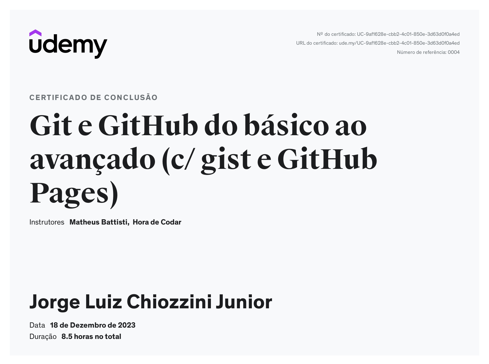
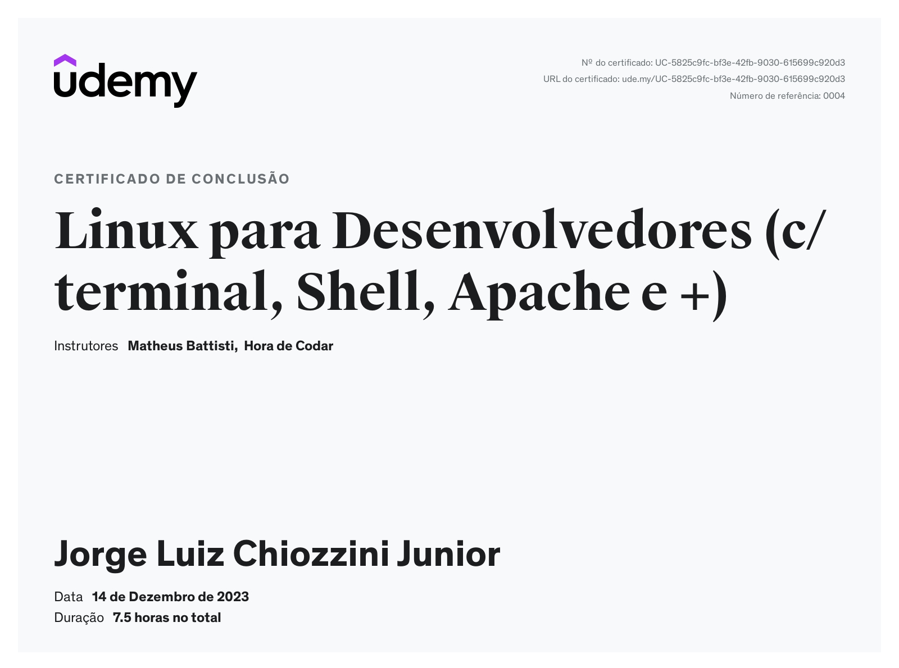

# Síntese de conhecimento

No curso de Git e GitHub, mergulhei profundamente no universo do controle de versão, compreendendo a importância de uma gestão eficaz do código-fonte. Desenvolvi habilidades sólidas no uso do Git para rastrear mudanças, criar branches estratégicos e realizar fusões de código de maneira eficiente. Além disso, explorei a colaboração efetiva no GitHub, onde aprendi a criar pull requests, gerenciar issues e participar de projetos colaborativos. Acredito que estas competências são fundamentais para a integração tranquila em equipes de desenvolvimento e para manter a coesão no ciclo de vida do software.  
No segundo curso, dedicado aos comandos no terminal Linux, aprofundei-me na compreensão prática do ambiente de desenvolvimento Linux. Desde a navegação eficiente no sistema de arquivos até o gerenciamento de pacotes, usuários e permissões, adquiri uma compreensão abrangente dos comandos Linux. Essa proficiência não apenas aumenta a eficiência operacional, mas também fortalece minha capacidade de diagnosticar e resolver problemas no ambiente de desenvolvimento.

# Certificados

- Certificado do Curso Git e GitHub do básico ao avançado

- Certificado do Curso Linux para desenvolvedores

- Certificado do Curso Métodos Ágeis de A a Z

