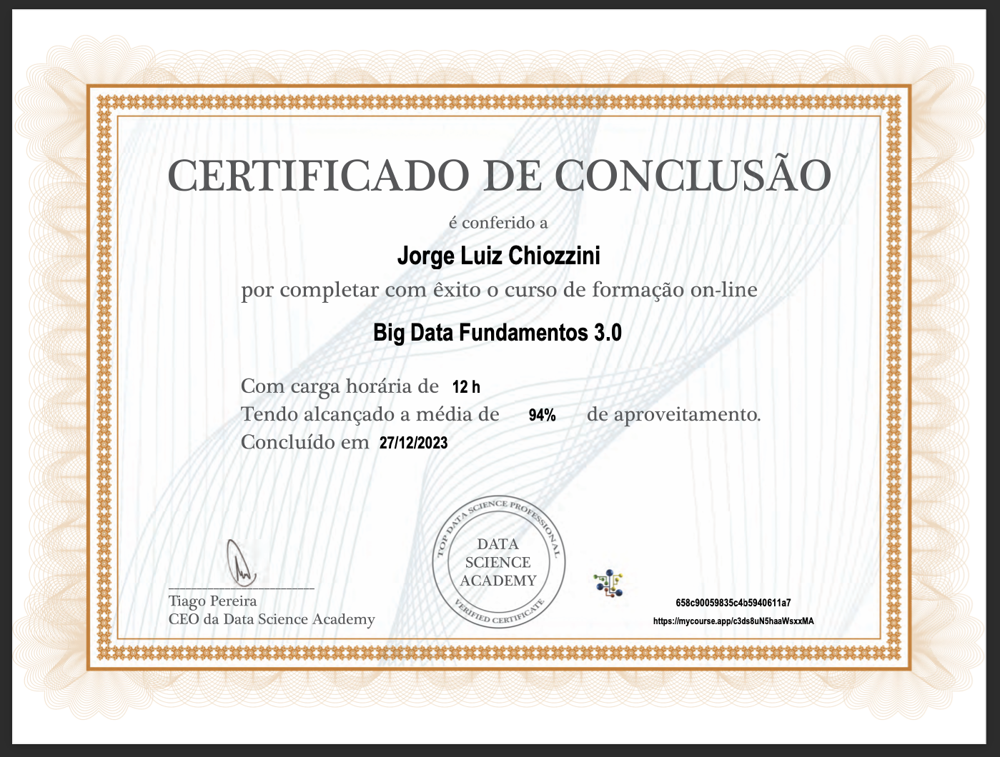
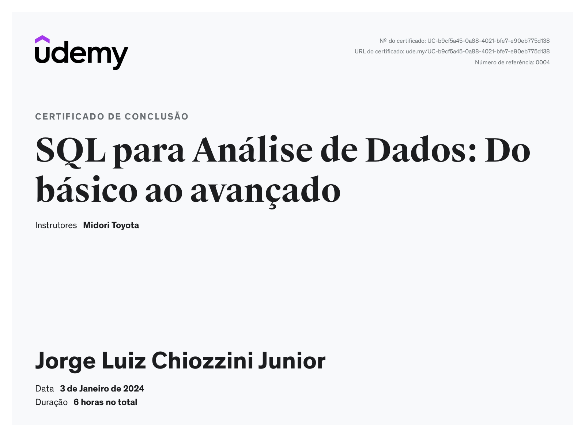

# Exercícios
Nesta seção encontram-se os respectivos arquivos contendo os resultados dos desafios da sprint 02, cada arquivo Resposta Ex. contém a Query seguido pela tabela resposta aos exercícios, além dos arquivos SQL e CSV dos resultados.

1. ...
[Resposta Ex1.](exercicios/SECAO3-E1.txt) ; [SQL 1](evidencias/SECAO3-E1.sql) ; [CSV 1](evidencias/SECAO3-E1.csv)

2. ...
[Resposta Ex2.](exercicios/SECAO3-E2.txt) ; [SQL 2](evidencias/SECAO3-E2.sql) ; [CSV 2](evidencias/SECAO3-E2.csv)

3. ...
[Resposta Ex3.](exercicios/SECAO3-E3.txt) ; [SQL 3](evidencias/SECAO3-E3.sql) ; [CSV 3](evidencias/SECAO3-E3.csv)

4. ...
[Resposta Ex4.](exercicios/SECAO3-E4.txt) ; [SQL 4](evidencias/SECAO3-E4.sql) ; [CSV 4](evidencias/SECAO3-E4.csv)

5. ...
[Resposta Ex5.](exercicios/SECAO3-E5.txt) ; [SQL 5](evidencias/SECAO3-E5.sql) ; [CSV 5](evidencias/SECAO3-E5.csv)

6. ...
[Resposta Ex6.](exercicios/SECAO3-E6.txt) ; [SQL 6](evidencias/SECAO3-E6.sql) ; [CSV 6](evidencias/SECAO3-E6.csv)

7. ...
[Resposta Ex7.](exercicios/SECAO3-E7.txt) ; [SQL 7](evidencias/SECAO3-E7.sql) ; [CSV 7](evidencias/SECAO3-E7.csv)

8. ...
[Resposta Ex8.](exercicios/SECAO4-E8.txt) ; [SQL 8](evidencias/SECAO4-E8.sql) ; [CSV 8](evidencias/SECAO4-E8.csv)

9. ...
[Resposta Ex9.](exercicios/SECAO4-E9.txt) ; [SQL 9](evidencias/SECAO4-E9.sql) ; [CSV 9](evidencias/SECAO4-09.csv)

10. ...
[Resposta Ex10.](exercicios/SECAO4-E10.txt) ; [SQL 10](evidencias/SECAO4-E10.sql) ; [CSV 10](evidencias/SECAO4-E10.csv)

11. ...
[Resposta Ex11.](exercicios/SECAO4-E11.txt) ; [SQL 11](evidencias/SECAO4-E11.sql) ; [CSV 11](evidencias/SECAO4-E11.csv)

12. ...
[Resposta Ex12.](exercicios/SECAO4-E12.txt) ; [SQL 12](evidencias/SECAO4-E12.sql) ; [CSV 12](evidencias/SECAO4-E12.csv)

13. ...
[Resposta Ex13.](exercicios/SECAO4-E13.txt) ; [SQL 13](evidencias/SECAO4-E13.sql) ; [CSV 13](evidencias/SECAO4-E13.csv)

14. ...
[Resposta Ex14.](exercicios/SECAO4-E14.txt) ; [SQL 14](evidencias/SECAO4-E14.sql) ; [CSV 14](evidencias/SECAO4-E14.csv)

15. ...
[Resposta Ex15.](exercicios/SECAO4-E15.txt) ; [SQL 15](evidencias/SECAO4-E15.sql) ; [CSV 15](evidencias/SECAO4-E15.csv)

16. ...
[Resposta Ex16.](exercicios/SECAO4-E16.txt) ; [SQL 16](evidencias/SECAO4-E16.sql) ; [CSV 16](evidencias/SECAO4-E16.csv)

# Tarefas 
Nesta seção encontram-se os arquivos de exportação CSV propostos pelas Tarefas da sprint 02.

- Tarefa 01 ";"
[Tarefa 01](tarefas/Tarefa-01.csv)

- Tareda 02 "|"
[Tarefa 02](tarefas/Tarefa-02.csv)

# Certificados

- Certificado do Curso Big Data Fundamentos 3.0

- Certificado do Curso SQL para Análise de Dados

