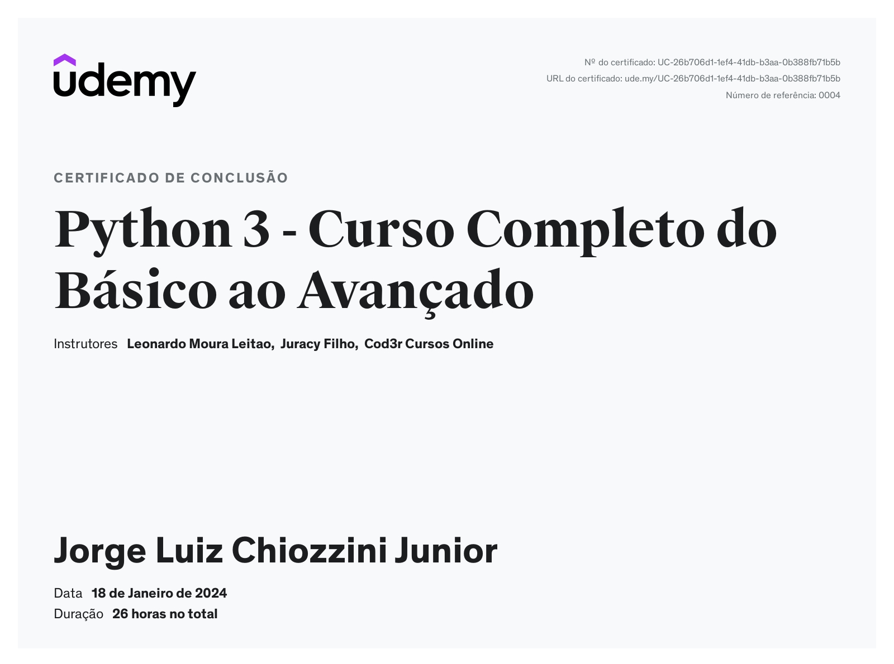
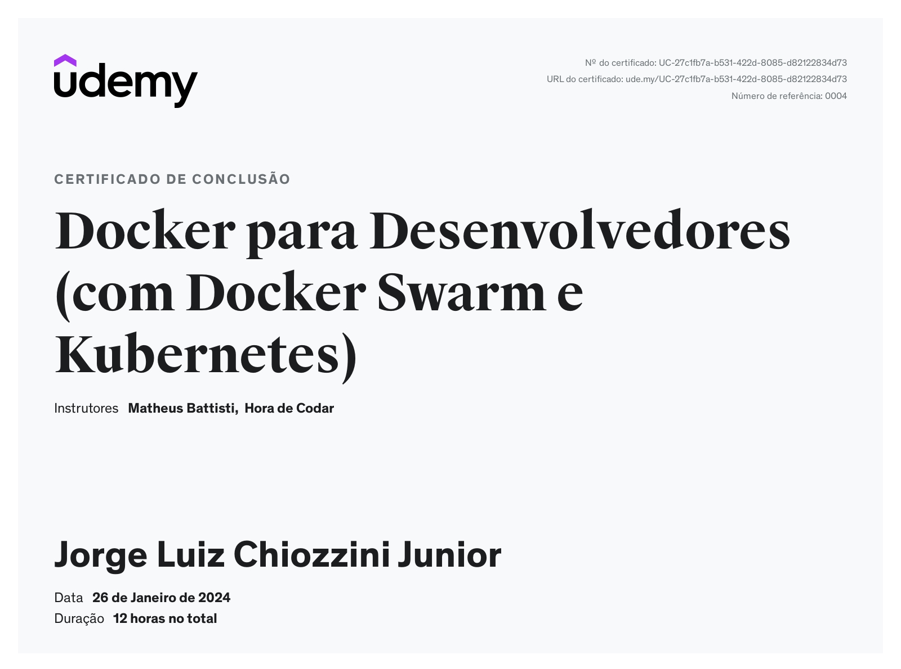

<h1 align="center"> Sprint 4</h1>

 <a href="#sobre">Sobre</a> •
 <a href="#Relatórios">Relatórios</a> •
 <a href="#exercicios-p">Exercícios Python</a> •
 <a href="#exercicios-d">Exercícios Docker</a> •
 <a href="#Certificados">Certificados</a>

  

## 📎  Sobre

### Cursos
- [Programação funcional: O que é? | Alura](https://www.alura.com.br/artigos/programacao-funcional-o-que-e)
- [Programação em Python do básico ao avançado (Apenas seção programação funcional)](https://www.udemy.com/course/curso-de-programacao-em-python-do-basico-ao-avancado/) 
- [Docker para Desenvolvedores (com Docker Swarm e Kubernetes)](https://www.udemy.com/course/docker-para-desenvolvedores-com-docker-swarm-e-kubernetes/?utm_source=adwords-intl&utm_medium=udemyads&utm_campaign=Docker_new_v.PROF_la.PT_cc.BR_ti.5470&utm_content=deal4584&utm_term=_._ag_125593859508_._kw__._ad_494752817465_._de_c_._dm__._pl__._ti_dsa-1208106377687_._li_9047798_._pd__._&gclid=CjwKCAjwoIqhBhAGEiwArXT7K0ddLdm9pC0336i3Oqlv8wpm_CF8xwEvSrNfRGAF-Uy5hzsWsUmMtxoCEpsQAvD_BwE)
- [Estatística Descritiva com Python](https://www.udemy.com/course/estatistica-descritiva-com-python/?utm_source=adwords-intl&utm_medium=udemyads&utm_campaign=LongTail_new_la.PT_cc.BR&utm_content=deal4584&utm_term=_._ag_118044111482_._kw__._ad_491671393381_._de_c_._dm__._pl__._ti_dsa-1131315795588_._li_9047798_._pd__._&gclid=CjwKCAjwoIqhBhAGEiwArXT7KzaCVK0QE72bKC_JltqiCVMAqUVcjZml1yngt6eEpeOQ2-6eSg12HBoCIeoQAvD_BwE)

 

## 📝  Relatórios de conhecimento

* [Programação Funcional](evidencias/python.md)

* [Docker](evidencias/docker.md)

* [Estatística Descritiva](evidencias/estatistica.md)

 

## 🐍  Exercícios Programação Funcional Python

* Dados: [estudantes.csv](evidencias/estudantes.csv)  /  [number.txt](evidencias/number.txt)

* Testes notebook: [JupyterNotebook](evidencias/testes.ipynb)

1. Resposta EX. 01 : [EX01.py](exercicios/ex01.py)

2. Resposta EX. 02 : [EX02.py](exercicios/ex02.py)

3. Resposta EX. 03 : [EX03.py](exercicios/ex03.py)

4. Resposta EX. 04 : [EX04.py](exercicios/ex04.py)

5. Resposta EX. 05 : [EX05.py](exercicios/ex05.py)

6. Resposta EX. 06 : [EX06.py](exercicios/ex06.py)

7. Resposta EX. 07 : [EX07.py](exercicios/ex07.py)

 

##  🐋  Exercícios Containers Docker 

1. Resposta: [Tarefa 01](exercicios/ex01.md)

2. Resposta: [Tarefa 02](exercicios/ex02.md)

3. Resposta: [Tarefa 03](exercicios/ex03.md)

 

## 🏆 Certificados

- Certificado do Curso Python 3 (Seção Python Funcional)

- Certificado do Curso Docker para Desenvolvedores 

- Certificado do Curso Estatística Descritiva com Python
