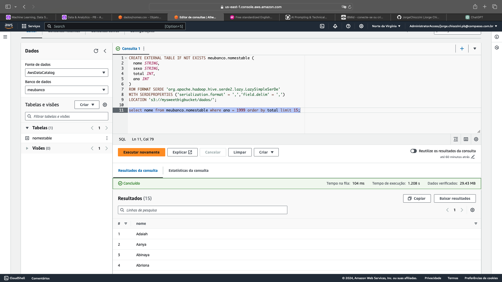

<h1 align="center"> Sprint 6</h1>

<p align="center">
 <a href="#sobre">Sobre</a> •
 <a href="#labs">Laboratórios</a>
</p>

<br> 

<a id="sobre"></a>
## 📎  Sobre

### Cursos e certificados

- [AWS Skill Builder - Data Analytics Fundamentals (Portuguese)](certificados/DataAnalytics%20Fundamentals.png)
- [AWS Partner: Data Analytics on AWS (Business) (Portuguese)](certificados)
- [AWS Skill Builder - Introduction to Amazon Kinesis Streams](certificados)
- [AWS Skill Builder - Introduction to Amazon Kinesis Analytics](certificados)
- [AWS Skill Builder - Introduction to Amazon Elastic MapReduce (EMR) (Portuguese)](ertificados)
- [AWS Skill Builder - Introduction to Amazon Athena (Portuguese)](certificados)
- [AWS Skill Builder - Introduction to Amazon Quicksight (Portuguese)](certificados)
- [AWS Skill Builder - Introduction to AWS IoT Analytics](certificados)
- [AWS Skill Builder - Getting Started with Amazon Redshift](certificados)
- [AWS Skill Builder - Deep Dive into Concepts and Tools for Analyzing Streaming Data (Portuguese)](certificados)
- [AWS Skill Builder - Best Practices for Data Warehousing with Amazon Redshift (Portuguese)](certificados)
- [AWS Skill Builder - Serverless Analytics (Portuguese)](certificados)
- [AWS Skill Builder - Why Analytics for Games (Portuguese)](certificados)

<br>

<a id="labs"></a>
## 👩‍💻  Laboratórios

### AWS S3

Objetivo:  
Explorar as capacidades do serviço AWS S3.  Nos passos que seguem, você será guiado pelas configurações necessárias para que um bucket do Amazon S3 funcione como hospedagem de conteúdo estático.

* [dados/nomes.csv](evidencias/dados/nomes.csv)
* [index.html](evidencias/index.html)
* [404.html](evidencias/404.html)

Criar um bucket e habilitar hospedagem de site estático    


Editar as configurações do Bloqueio de acesso público, adicionar política de bucket que torna o conteúdo do bucket publicamente disponível   


Configurar um documento de índice   


Testar o endpoint do site    


---

### AWS Athena

Configurar Athena, criar um banco de dados, criar uma tabela





Crie uma consulta que lista os 3 nomes mais usados em cada década desde o 1950 até hoje.

Código:

```sql
WITH rankingtable AS (
    SELECT
        nome, 
        CONCAT(SUBSTR(CAST(ano AS VARCHAR), 1, 3), '0') AS decada, 
        RANK() OVER(PARTITION BY CONCAT(SUBSTR(CAST(ano AS VARCHAR), 1, 3), '0') ORDER BY SUM(total) DESC, nome ASC) AS ranking 
    FROM meubanco.nomestable
    WHERE ano >= 1950
    GROUP BY nome, CONCAT(SUBSTR(CAST(ano AS VARCHAR), 1, 3), '0') 
)

SELECT 
    nome, 
    decada,
    RANK() OVER(PARTITION BY decada ORDER BY ranking) AS posicao
FROM rankingtable 
WHERE ranking IN (1, 2, 3) 
ORDER BY decada, posicao;
```


* [Resultado - saida.csv](evidencias/saida.csv)

---

### 