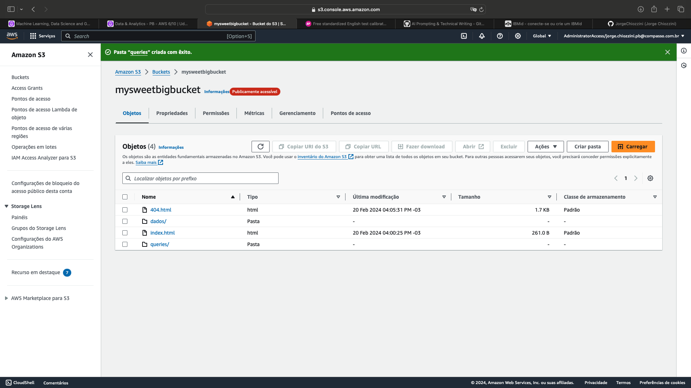
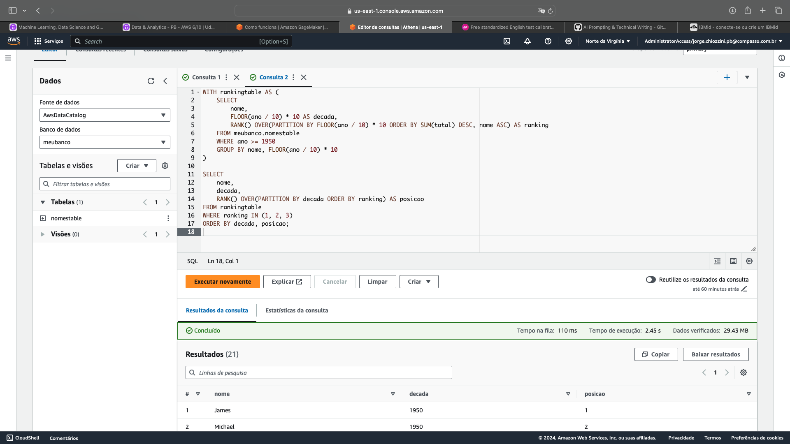
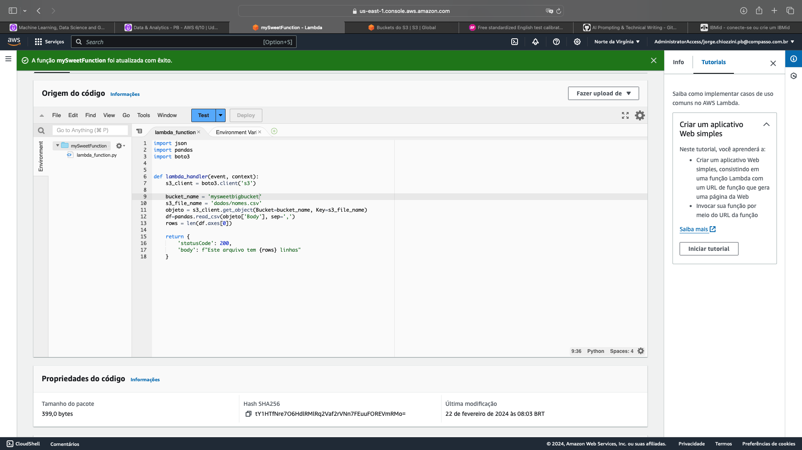
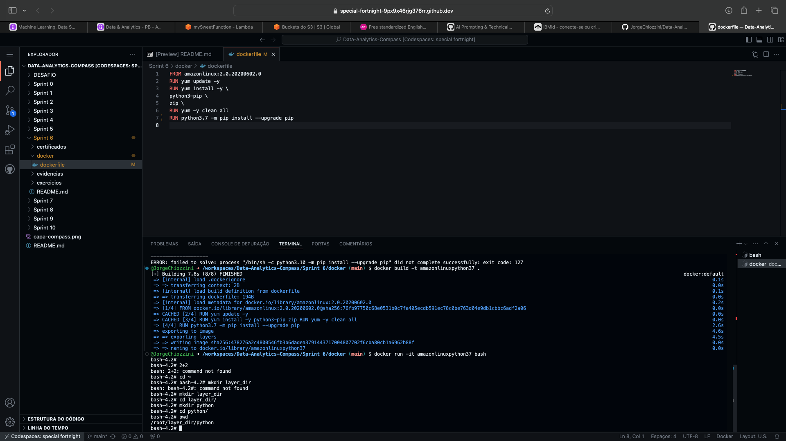
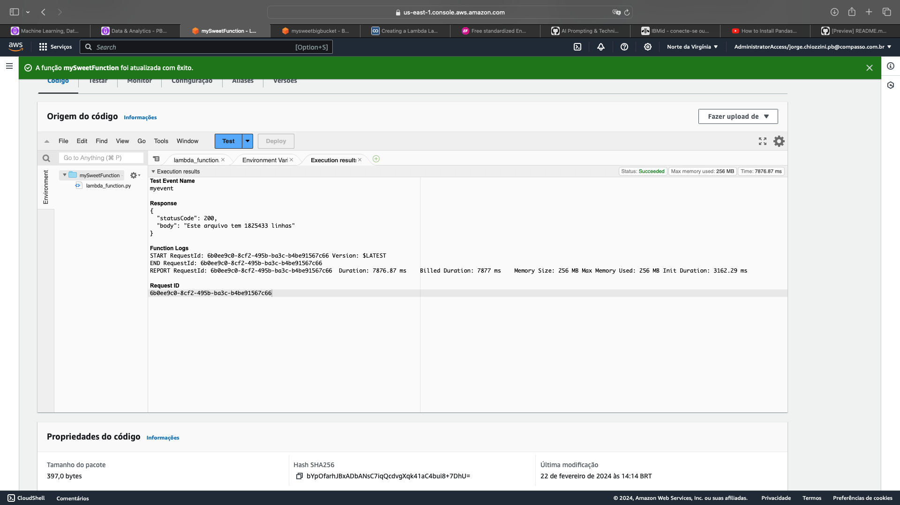

<h1 align="center"> Sprint 6</h1>

<p align="center">
 <a href="#sobre">Sobre</a> •
 <a href="#labs">Laboratórios</a>
</p>

<br> 

<a id="sobre"></a>
## 📎  Sobre

### Cursos e certificados

- [AWS Skill Builder - Data Analytics Fundamentals](certificados/DataAnalytics%20Fundamentals.png)
- [AWS Partner: Data Analytics on AWS (Business)](certificados/Data%20Analytics%20on%20AWS.png)
- [AWS Skill Builder - Introduction to Amazon Kinesis Streams](certificados)
- [AWS Skill Builder - Introduction to Amazon Kinesis Analytics](certificados)
- [AWS Skill Builder - Introduction to Amazon Elastic MapReduce (EMR)](certificados)
- [AWS Skill Builder - Introduction to Amazon Athena](certificados)
- [AWS Skill Builder - Introduction to Amazon Quicksight](certificados)
- [AWS Skill Builder - Introduction to AWS IoT Analytics](certificados)
- [AWS Skill Builder - Getting Started with Amazon Redshift](certificados)
- [AWS Skill Builder - Deep Dive into Concepts and Tools for Analyzing Streaming Data](certificados)
- [AWS Skill Builder - Best Practices for Data Warehousing with Amazon Redshift](certificados)
- [AWS Skill Builder - Serverless Analytics](certificados)
- [AWS Skill Builder - Why Analytics for Games](certificados)

<br>

<a id="labs"></a>
## 👩‍💻  Laboratórios

### AWS S3

Objetivo:  
Explorar as capacidades do serviço AWS S3.  Nos passos que seguem, você será guiado pelas configurações necessárias para que um bucket do Amazon S3 funcione como hospedagem de conteúdo estático.

* [dados/nomes.csv](evidencias/dados/nomes.csv)
* [index.html](evidencias/index.html)
* [404.html](evidencias/404.html)

Criar um bucket e habilitar hospedagem de site estático, editar as configurações do Bloqueio de acesso público, adicionar política de bucket que torna o conteúdo do bucket publicamente disponível, configurar um documento de índice   


Testar o endpoint do site    


---

### AWS Athena

Configurar Athena, criar um banco de dados, criar uma tabela



Crie uma consulta que lista os 3 nomes mais usados em cada década desde o 1950 até hoje.

Código:

```sql
WITH rankingtable AS (
    SELECT
        nome, 
        FLOOR(ano / 10) * 10 AS decada, 
        RANK() OVER(PARTITION BY FLOOR(ano / 10) * 10 ORDER BY SUM(total) DESC, nome ASC) AS ranking 
    FROM meubanco.nomestable
    WHERE ano >= 1950
    GROUP BY nome, FLOOR(ano / 10) * 10
)

SELECT 
    nome, 
    decada,
    RANK() OVER(PARTITION BY decada ORDER BY ranking) AS posicao
FROM rankingtable 
WHERE ranking IN (1, 2, 3) 
ORDER BY decada, posicao;

```



* [Resultado - saida.csv](evidencias/saida.csv)

---

### AWS Lambda

Criar a função do Lambda, construir o código



Criar uma Layer
* [minha-camada-pandas](docker/minha-camada-pandas.zip)



Utilizando a Layer, resultado


