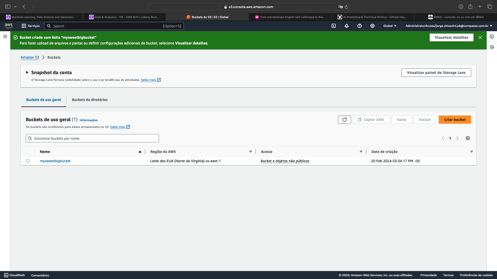
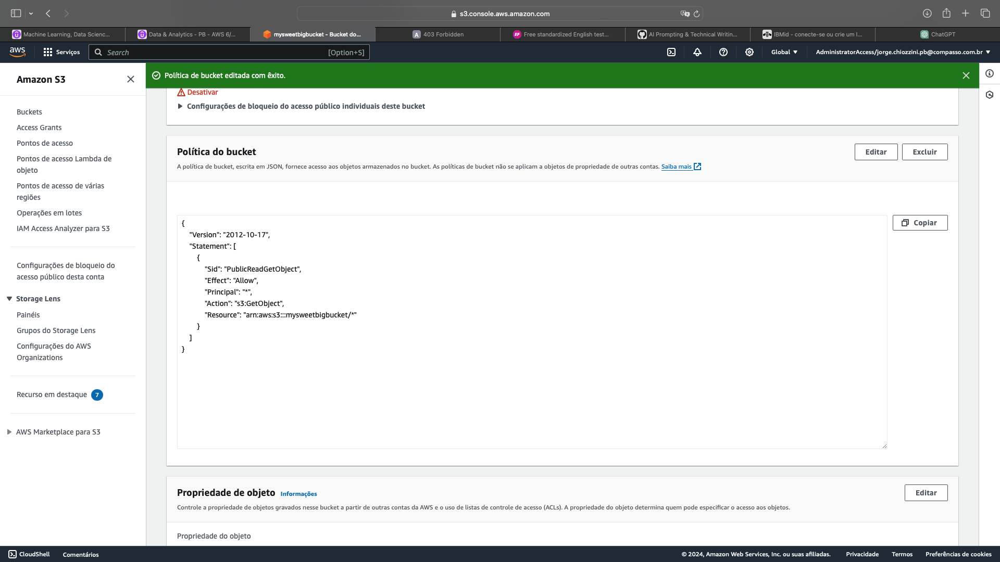
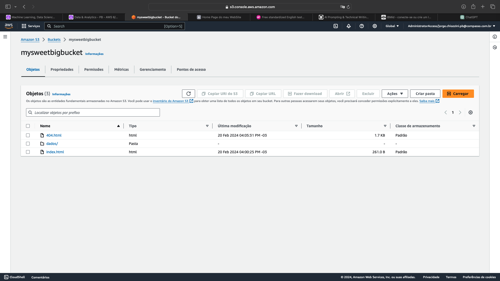
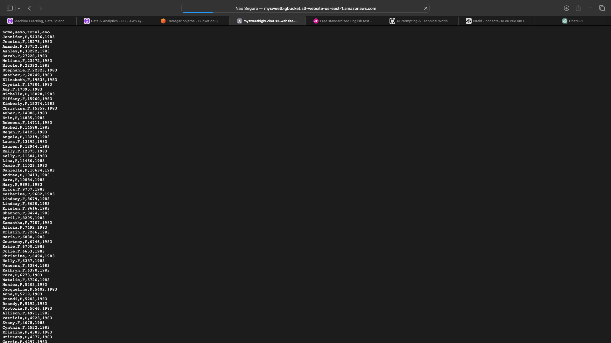

<h1 align="center"> Sprint 6</h1>

 <a href="#sobre">Sobre</a> •
 <a href="#labs">Laboratórios</a>

  

## 📎  Sobre

### Cursos e certificados

- [AWS Skill Builder - Data Analytics Fundamentals (Portuguese)](/certificados/sprint6_AWS-DataAnalytics.PNG)
- [AWS Partner: Data Analytics on AWS (Business) (Portuguese)](/certificados/sprint6_AWS-DataAnalytics-Business.PNG)
- [AWS Skill Builder - Introduction to Amazon Kinesis Streams](/certificados/sprint6_AWS-KinesisStreams.PNG)
- [AWS Skill Builder - Introduction to Amazon Kinesis Analytics](/certificados/sprint6_AWS-KinesisAnalytics.PNG)
- [AWS Skill Builder - Introduction to Amazon Elastic MapReduce (EMR) (Portuguese)](/certificados/sprint6_AWS-EMR.PNG)
- [AWS Skill Builder - Introduction to Amazon Athena (Portuguese)](/certificados/sprint6_AWS-Athena.PNG)
- [AWS Skill Builder - Introduction to Amazon Quicksight (Portuguese)](/certificados/sprint6_AWS-QuickSight.PNG)
- [AWS Skill Builder - Introduction to AWS IoT Analytics](/certificados/sprint6_AWS-IoT-Analytics.PNG)
- [AWS Skill Builder - Getting Started with Amazon Redshift](/certificados/sprint6_AWS-Redshift.PNG)
- [AWS Skill Builder - Deep Dive into Concepts and Tools for Analyzing Streaming Data (Portuguese)](/certificados/sprint6_AWS-Analysing-Streaming-Data.PNG)
- [AWS Skill Builder - Best Practices for Data Warehousing with Amazon Redshift (Portuguese)](/certificados/sprint6_AWS-DataWarehousing-with-Redshift.PNG)
- [AWS Skill Builder - Serverless Analytics (Portuguese)](/certificados/sprint6_AWS-Serverless-Analytics.PNG)
- [AWS Skill Builder - Why Analytics for Games (Portuguese)](/certificados/sprint6_AWS-AnalyticsGame.PNG)

 

## 👩‍💻  Laboratórios

### AWS S3

Objetivo:  
Explorar as capacidades do serviço AWS S3.  Nos passos que seguem, você será guiado pelas configurações necessárias para que um bucket do Amazon S3 funcione como hospedagem de conteúdo estático.

* [dados/nomes.csv](evidencias/dados/nomes.csv)
* [index.html](evidencias/index.html)
* [404.html](evidencias/404.html)

Criar um bucket e habilitar hospedagem de site estático    

Editar as configurações do Bloqueio de acesso público, adicionar política de bucket que torna o conteúdo do bucket publicamente disponível   

Configurar um documento de índice   

Testar o endpoint do site    

---

