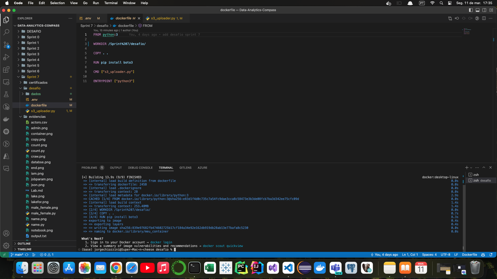
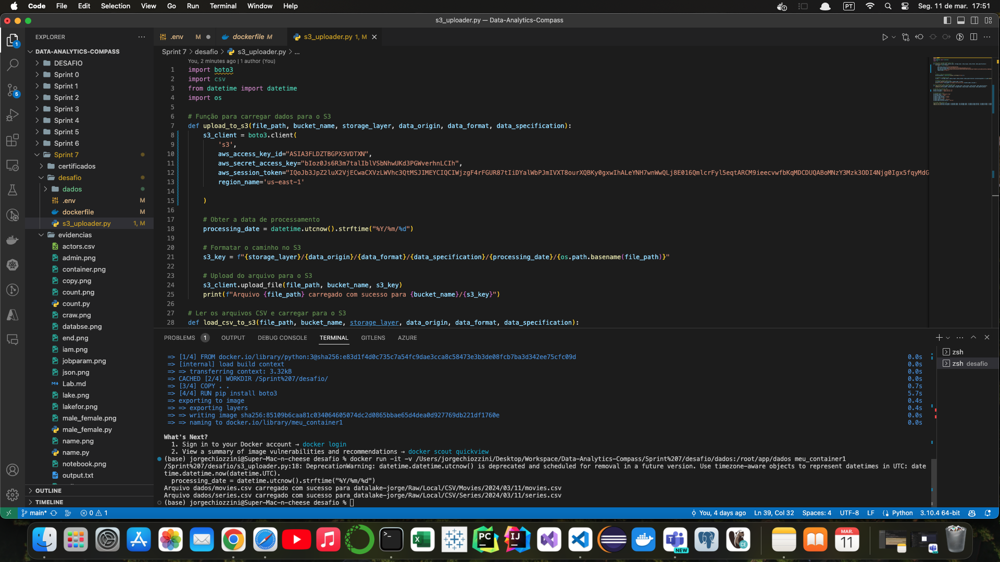
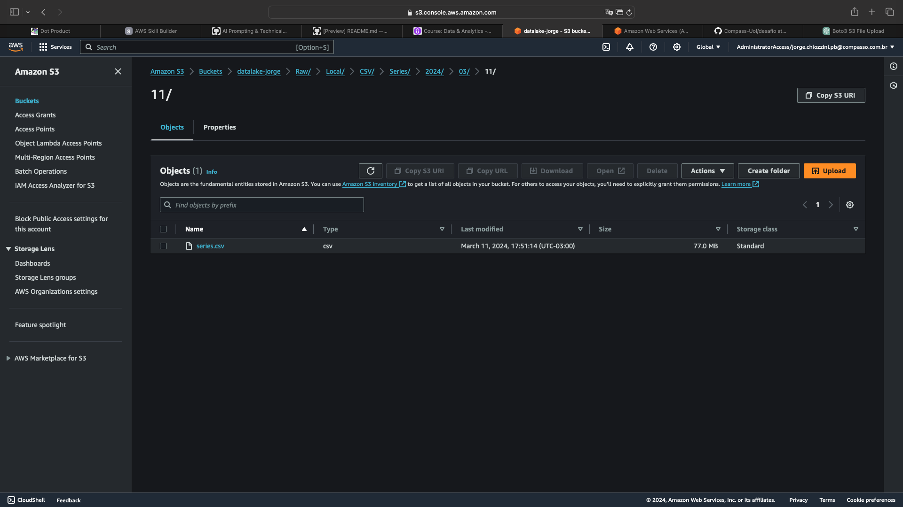

<h1 align="center"> Sprint 7</h1>

<p align="center">
 <a href="#sobre">Sobre</a> •
 <a href="#tarefa">Tarefa</a> •
 <a href="#Laboratório">Laboratório</a> •
 <a href="#desafio">Desafio</a>
</p>

<br> 

<a id="sobre"></a>
## 📎  Sobre

### Cursos e certificados
- [Hadoop, MapReduce for Big Data problems](certificados/hadoop.png)
- [Formação Spark com Pyspark](certificados)

### Leitura
- [Arquitetura Lambda, ETL/ELT, Bibliotecas Python NumPy e Pandas](certificados/DA-ETL-Pandas-NumPy.pdf)
- [Apache Hadoop e Apache Spark](certificados/DA-Apache+Hadoop+e+Apache+Spark.pdf)

<br>

<a id="tarefa"></a>
## 📝   tarefa

### Python com Pandas e Numpy
- [actors.csv](evidencias/actors.csv)
- [Tarefa 1 - Resultado](evidencias/Tarefa1.ipynb)

### Apache Spark - Contador de Palavras
- [Tarefa 2 - Resultado](evidencias/Tarefa2.md)
- [output.txt](evidencias/output.txt)

<br>

<a id="Laboratório"></a>
## 👩‍💻 Laboratório

### Lab AWS Glue
- [Lab - Resultado](evidencias/Lab.md)

<br>

<a id="desafio"></a>
## 🎯  Desafio 

### Tarefa: Desafio Parte 1 - ETL


**Instruções da Tarefa**

**Ingestão Batch:**

A ingestão dos arquivos CSV será realizada no Bucket Amazon S3 RAW Zone. Nesta etapa do desafio, é necessário construir um código Python que será executado dentro de um container Docker para carregar os dados locais dos arquivos para a nuvem. O processo utilizará principalmente a biblioteca boto3 para a ingestão via batch, gerando arquivos CSV.

1. **Implementar código Python:**
    - Ler os 2 arquivos (filmes e séries) no formato CSV inteiros, ou seja, sem filtrar os dados.
    - Utilizar a biblioteca boto3 para carregar os dados para a AWS.
    - Acessar a AWS e gravar no S3, no bucket definido como RAW Zone.
    - No momento da gravação dos dados, considerar o padrão:
        ```
        S3://data-lake-do-fulano/Raw/Local/CSV/Movies/2022/05/02/movies.csv
        S3://data-lake-do-fulano/Raw/Local/CSV/Series/2022/05/02/series.csv
        ```
        Onde:
        - `data-lake-do-fulano` é o nome do bucket.
        - `Raw` é a camada de armazenamento.
        - `Local` é a origem do dado.
        - `CSV` é o formato do dado.
        - `Movies` ou `Series` são as especificações do dado.
        - `2022/05/02` é a data de processamento separada por ano/mês/dia.
        - `movies.csv` ou `series.csv` é o nome do arquivo.

<br>

- [Resultado - s3_uploader.py](desafio/s3_uploader.py)

<br>

2. **Criar container Docker com um volume para armazenar os arquivos CSV e executar processo Python implementado.**

- [Resultado - dockerfile](desafio/dockerfile)

```
$ docker build -t meu_container .      
```
 

<br>

3. **Executar localmente o container Docker para realizar a carga dos dados ao S3.**

- [dados](desafio/dados/dados.zip)
- [.env](desafio/.env)

```
$ docker run -it -v /Users/jorgechiozzini/Desktop/Workspace/Data-Analytics-Compass/Sprint%207/desafio/dados:/root/app/dados --env-file .env meu_container 
```





