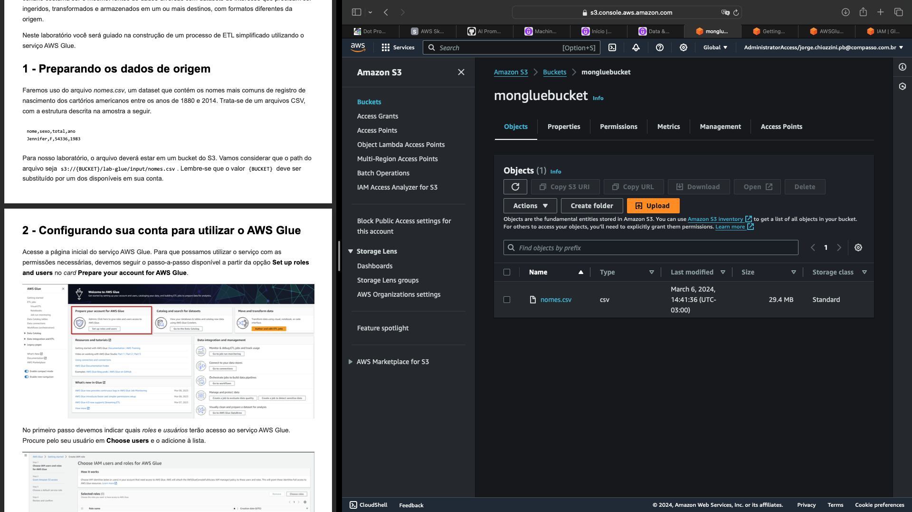
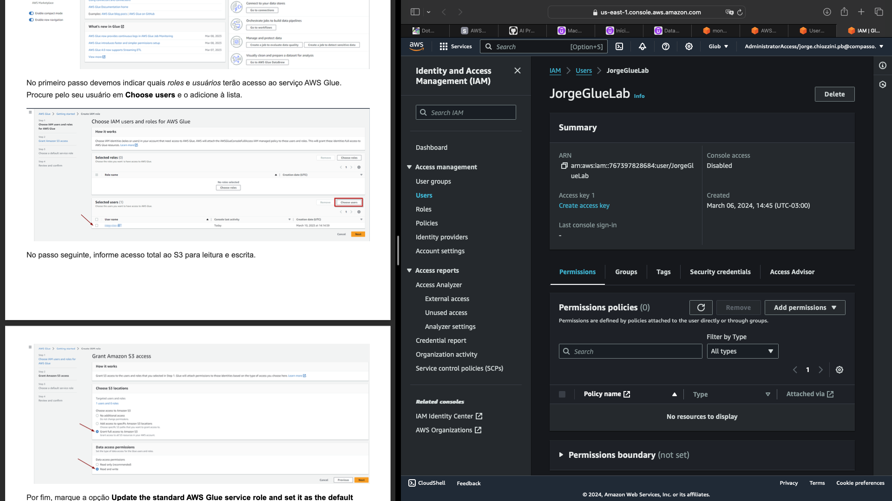
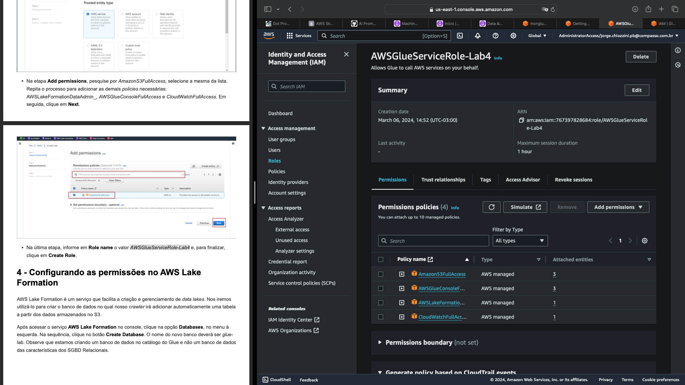
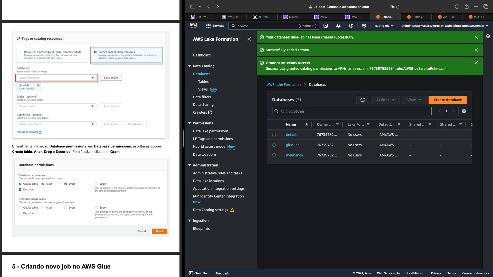
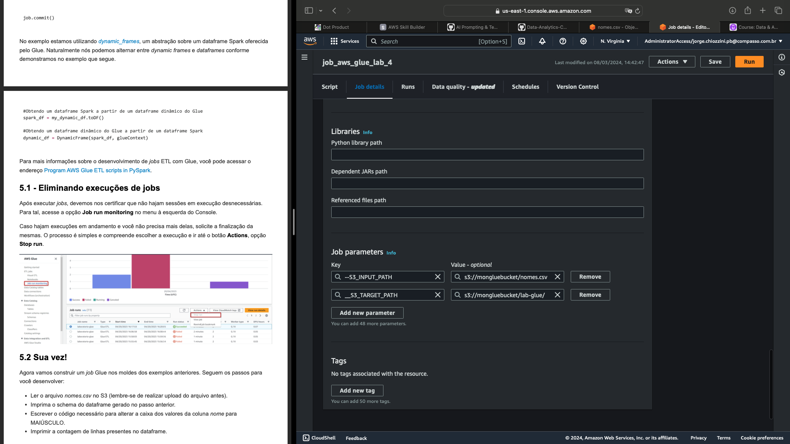

# Laboratório de AWS Glue

## 1. Preparando os dados de origem

  

## 2. Configurando sua conta para utilizar o AWS Glue

  

## 3. Criando a IAM Role para os jobs do AWS Glue

  

## 4. Configurando as permissões no AWS Lake Formation

  

## 5. Criando novo job no AWS Glue

  

## 6. Criando novo crawler

  