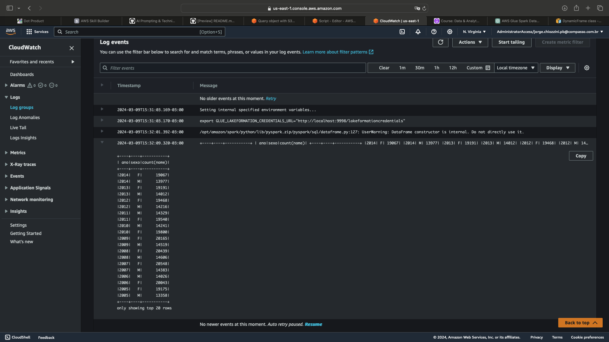

# Laboratório de AWS Glue

## 1. Preparando os dados de origem

  

 

## 2. Configurando sua conta para utilizar o AWS Glue

  

 

## 3. Criando a IAM Role para os jobs do AWS Glue

  

 

## 4. Configurando as permissões no AWS Lake Formation

  

 

## 5. Criando novo job no AWS Glue

Ler o arquivo nomes.csv no S3 (lembre-se de realizar upload do arquivo antes).  
Imprima o schema do dataframe gerado no passo anterior.

  

- [schema.py](schema.py)

Escrever o código necessário para alterar a caixa dos valores da coluna nome para
MAIÚSCULO.

  

- [upper.py](upper.py)

Imprimir a contagem de linhas presentes no dataframe.

  

- [count.py](count.py)

Imprimir a contagem de nomes, agrupando os dados do dataframe pelas colunas ano e sexo.
Ordene os dados de modo que o ano mais recente apareça como primeiro registro do dataframe.

  

- [name.py](name.py)

Apresentar qual foi o nome feminino com mais registros e em que ano ocorreu.  
Apresentar qual foi o nome masculino com mais registros e em que ano ocorreu.

  

- [male_female.py](male_female.py)

Apresentar o total de registros (masculinos e femininos) para cada ano presente no dataframe. Considere apenas as primeiras 10 linhas, ordenadas pelo ano, de forma crescente.

  

- [year.py](year.py)

Escrever o conteúdo do dataframe com os valores de nome em maiúsculo no S3.
Atenção aos requisitos:
A gravação deve ocorrer no subdiretório frequencia_registro_nomes_eua do path
s3://<BUCKET>/lab-glue/
O formato deve ser JSON
O particionamento deverá ser realizado pelas colunas sexo e ano (nesta ordem)

  

  

- [write.py](write.py)

 

## 6. Criando novo crawler

  

  
