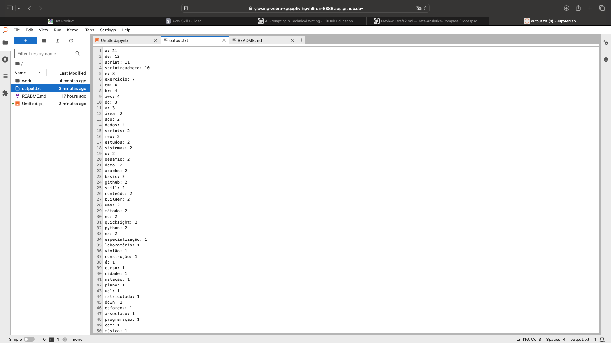

**Perguntas desta Tarefa**

1. Nesta atividade, faremos uso da imagem `jupyter/all-spark-notebook` ([jupyter/all-spark-notebook](https://registry.hub.docker.com/r/jupyter/all-spark-notebook)) para criar um container e utilizar o recurso de shell oferecido pelo Spark. Os passos a serem executados são:

   1.1 - Realizar o pull da imagem `jupyter/all-spark-notebook`.

   ```
   $ docker pull jupyter/all-spark-notebook
   ```
     

   1.2 - Criar um container a partir da imagem.

   ```
   $ docker run -it -p 8888:8888 jupyter/all-spark-notebook
   ```
   

   

   1.3 - Em outro terminal, execute o comando `pyspark` no seu container. Pesquise sobre o comando `docker exec` para realizar esta ação. Utilize as flags `-i` e `-t` no comando.

   ```
   $ docker exec -it 9a1c9f8e76b5 pyspark
   ```
   


2. Usando o Spark Shell, apresente a sequência de comandos Spark necessários para contar a quantidade de ocorrências de cada palavra contida no arquivo `README.md` de seu repositório Git.

```
$ docker cp README.md 9a1c9f8e76b5:/home/jovyan
```


- [WordCount.py](WordCount.py)

```python
from pyspark.sql import SparkSession
from pyspark.sql.functions import explode, lower, trim, regexp_replace
from pyspark.sql import functions as F

# Inicia a sessão Spark
spark = SparkSession.builder.appName('WordCount').getOrCreate()

# Lê o arquivo README.md
arquivo = spark.read.text("README.md")

# Utiliza Spark SQL para extrair palavras
arquivo.createOrReplaceTempView("arquivo_view")
palavras = spark.sql("""
    SELECT explode(split(lower(trim(regexp_replace(value, '[^a-zA-Z ]', ''))), ' ')) as palavra
    FROM arquivo_view
    WHERE trim(value) != ''
""")

# Filtra linhas em branco
palavras_limpo = palavras.filter("palavra != ''")

# Conta a frequência
contagem = palavras_limpo.groupBy("palavra").count()

# Ordena e exibe os resultados
ordenado = contagem.orderBy("count", ascending=False)

# Coleta os resultados
resultados = ordenado.collect()

# Salva os resultados em um arquivo de texto
with open("output.txt", "w") as file:
    for resultado in resultados:
        file.write(f"{resultado['palavra']}: {resultado['count']}\n")

# Encerra a sessão Spark
spark.stop()
```




```
$ docker cp 9a1c9f8e76b5:/home/jovyan/output.txt .
```

- [output.txt](output.txt)


