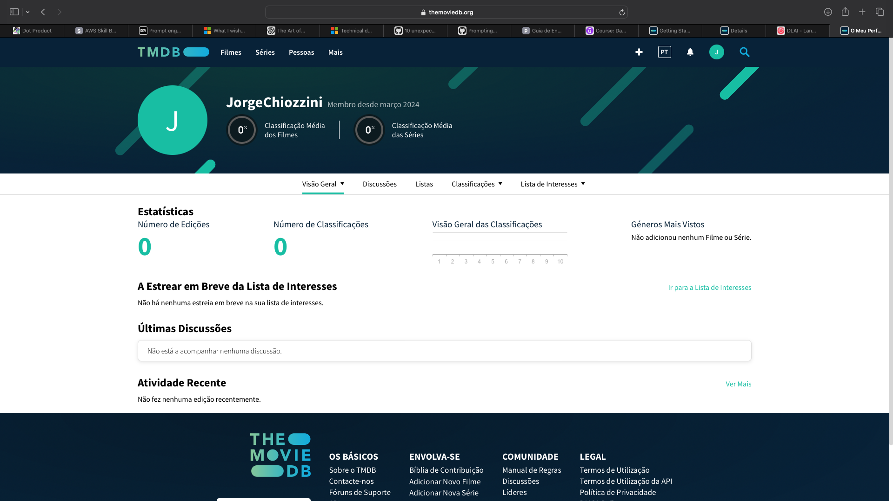
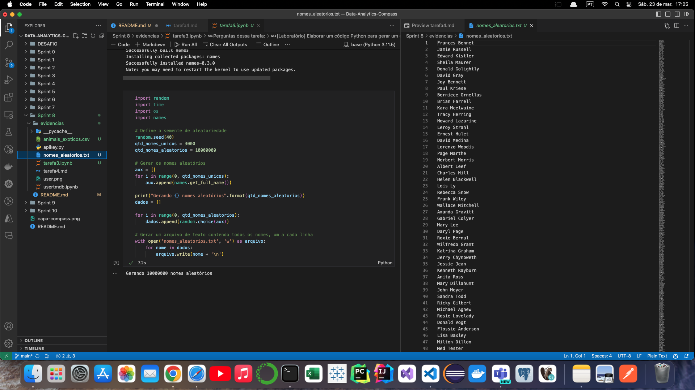
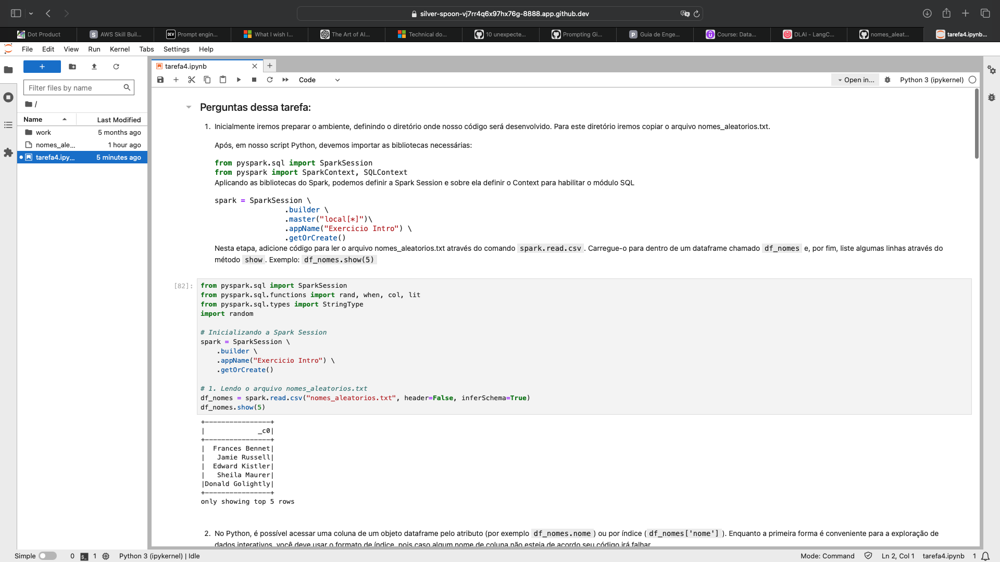
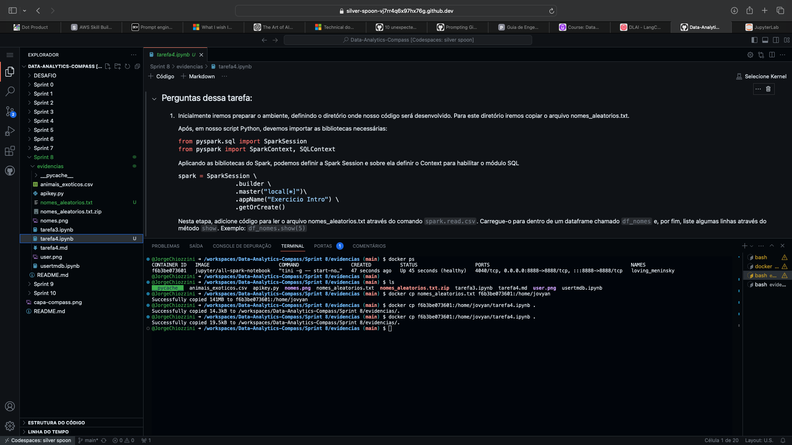

<h1 align="center"> Sprint 8</h1>

 <a href="#tarefa">Tarefa 1</a> •
 <a href="#desafio">Desafio</a> •
 <a href="#tarefa3">Tarefa 3</a> •
 <a href="#tarefa4">Tarefa 4</a>

 

## 📝   Tarefa 1

### Exercício TMDB
Nesta atividades iremos criar um processo de extração de dados da API do TMDB utilizando serviços da AWS.

**Etapa 1 -  Criando sua conta no TMDB**

  

 

**Etapa 2 - Testando rapidamente as credenciais e a biblioteca**

- [Resultado / teste](evidencias/usertmdb.ipynb)

 

## 🎯  Desafio 

### Desafio Parte II - Ingestão de dados do TMBD

- [Resultado](/DESAFIO/README.md#desafio-parte-ii---ingestão-de-dados-do-tmbd)

 

## 📝   Tarefa 3

### Exercícios - Geração de massa de dados

- [Resultado tarefa3.ipynb](evidencias/tarefa3.ipynb)

- [animais_exoticos.csv](evidencias/animais_exoticos.csv)

- [nomes_aleatorios.txt - zip](evidencias/nomes_aleatorios.txt)

VS code com meu repositório e o nomes_aleatorios.txt aberto:
  

 

## 📝   Tarefa 4

### Exercícios - Apache Spark

- [Resultado tarefa4.ipynb](evidencias/tarefa4.ipynb)

Servidor rodando spark em jupyter notebook onde desenvolvi a tarefa:
  

  