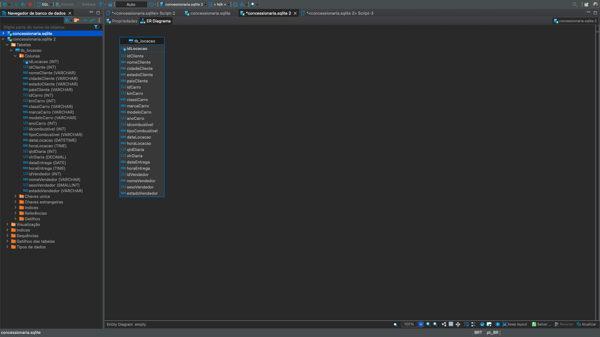
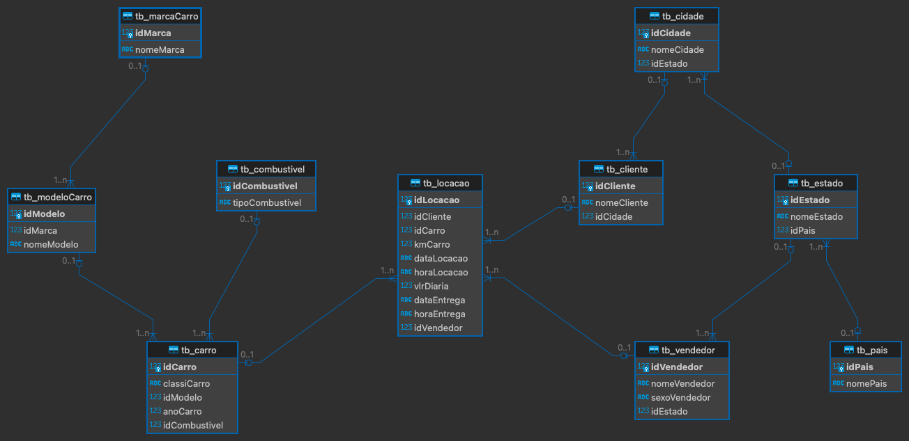
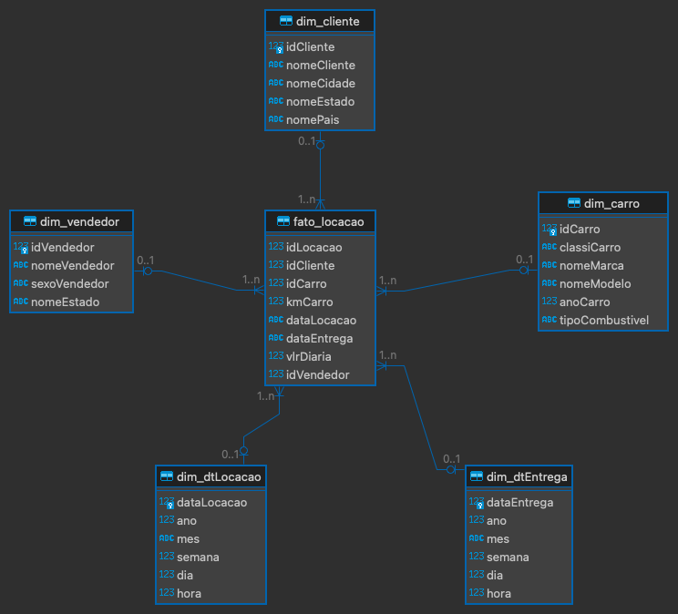

<h1 align="center"> Sprint 9</h1>

 <a href="#tarefa1">Tarefa 1</a> •
 <a href="#tarefa2">Tarefa 2</a> •
 <a href="#desafio">Desafio III</a>

---
  

## 📝   Tarefa 1 : Modelagem Relacional - Normalização

- [Texto Modelagem Relacional](evidencias/modeloRelacional.md)

Aqui você irá praticar conceitos de Modelagem relacional que estudou anteriormente. Estaremos considerando a base de dados Concessionaria, cujo modelo é apresentado na Modelagem Lógica abaixo.

- [concessionaria.sqlite](evidencias/concessionaria.sqlite)

**Antes da normalização:**

  

O desafio é normalizar esta base de dados, ou seja, aplicar as formas normais.

### Perguntas dessa tarefa

Adicione sua resposta (formato .SQL) ao seu repositório Git na respectiva Sprint.

- [Resultado - Script-Relacional.sql](evidencias/Script-SQL-Com.sql)

**Depois da normalização:**

  

---

 

## 📝   Tarefa 2 : Modelagem Dimensional - Criação de Modelo 

- [Texto Modelagem Dimensional](evidencias/modeloDimensional.md)

Aqui você irá praticar conceitos de Modelagem Dimensional que estudou anteriormente. Estaremos considerando a base de dados Concessionaria, cujo modelo será o criado por vocês na seção anterior (Modelagem Relacional).

O desafio é montar o Modelo Dimensional com base no Modelo Relacional (normalizado - feito por vocês) na seção anterior.

### Perguntas dessa tarefa
Adicione sua resposta (formato .SQL) ao seu repositório Git na respectiva Sprint.

- [Resultado - Script-Dimensional.sql](evidencias/Script-VIEW.sql)

**Star Schema:**

 

---
 

## 🎯  Desafio Parte III

 

- [Resultado](/DESAFIO/README.md#desafio-parte-iii)

---